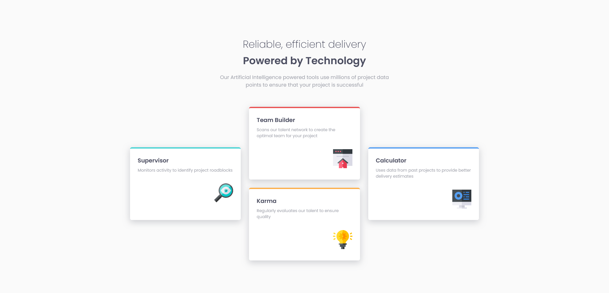
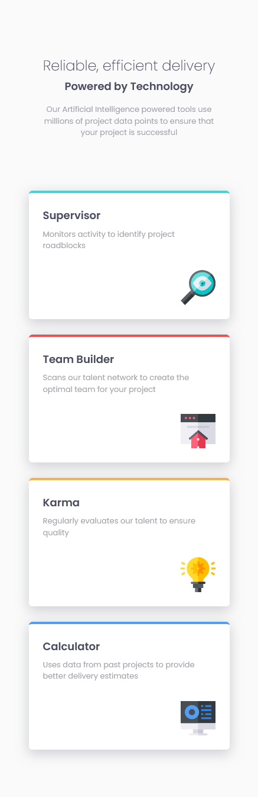

# Frontend Mentor - Four card feature section solution

This is a solution to the [Four card feature section challenge on Frontend Mentor](https://www.frontendmentor.io/challenges/four-card-feature-section-weK1eFYK).

## Table of contents

- [Overview](#overview)
  - [The challenge](#the-challenge)
  - [Screenshot](#screenshot)
  - [Links](#links)
- [My process](#my-process)
  - [Built with](#built-with)
  - [What I learned](#what-i-learned)
  - [Continued development](#continued-development)
- [Author](#author)

## Overview

### The challenge

Users should be able to:

- View the optimal layout for the site depending on their device's screen size.

### Screenshot

### Links

- Solution URL: [GitHub](https://github.com/wesleyjacoby/Four-Card-Feature-Section)
- Live Site URL: [GitHub Pages](https://wesleyjacoby.github.io/Four-Card-Feature-Section/)

## My process

### Built with

- Semantic HTML5 markup
- CSS custom properties
- CSS Grid

### What I learned

I am starting to get more comfortable with CSS Grid. Especially with using the `grid-template-areas` and `grid-area` properties and how to use them to make the grid responsive.

I am also getting much more comfortable developing for mobile first.

### Continued development

I want to continue practicing these sorts of challenges where they look more like sections of the website instead of a component of a website. These offer more of a challenge when it comes to positioning elements on the page.

## Author

- Frontend Mentor - [@wesleyjacoby](https://www.frontendmentor.io/profile/wesleyjacoby)